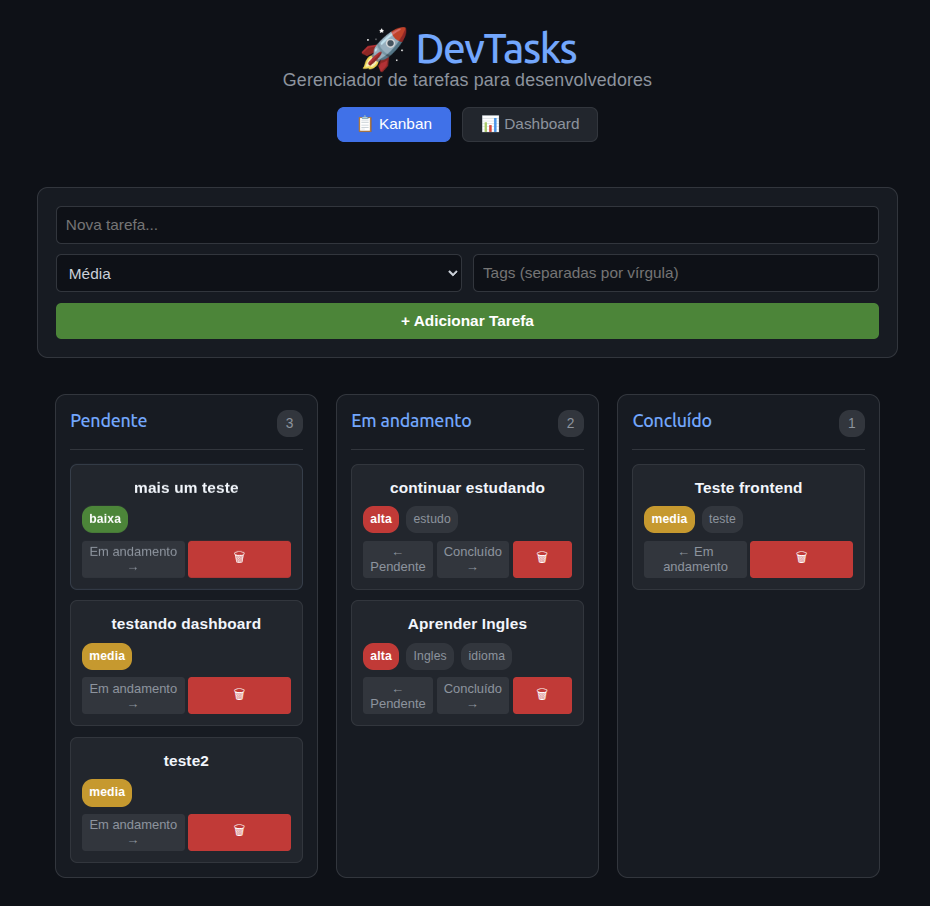
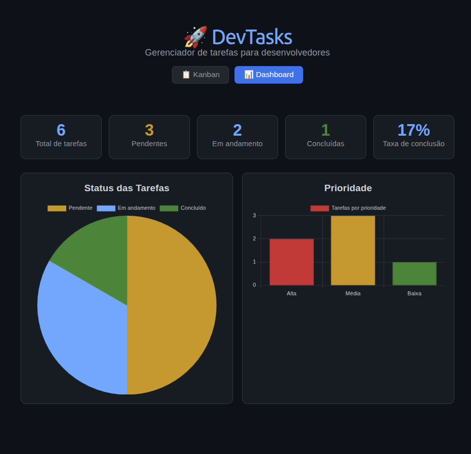

# DevTasks

Gerenciador de tarefas com Kanban Board e Dashboard de métricas.

## 📸 Screenshots

### Kanban Board


### Dashboard


## ✨ Funcionalidades

- Criar, editar e excluir tarefas
- Mover tarefas entre colunas (Pendente > Em andamento > Concluído)
- Definir Prioridade (Alta / Média / Baixa)
- Tags personalizadas
- Dashboard com métricas e gráficos
- Busca por texto e filtros (prioridade, status, tag)
- Ordenação por data, prioridade e título
- Tarefas isoladas por usuário
- Tema claro/escuro
- Layout responsivo (desktop, tablet, mobile)

## 🛠️ Stack

### Frontend
| Tecnologia | Versão |
|------------|--------|
| React | 19 |
| Vite | 8 |
| Axios | 1.18 |
| Chart.js | 4.5 |
| Context API | - |

### Backend
| Tecnologia | Versão |
|------------|--------|
| Node.js | 24 |
| Express | 5 |
| PostgreSQL | 16 |
| pg (driver) | 8 |
| bcryptjs | 3 |
| jsonwebtoken | 9 |

### DevOps
| Tecnologia |
|------------|
| Docker |
| Docker Compose |

## 🚀 Como rodar o projeto

### Com Docker (recomendado)

### Pré-requisitos

- [Docker](https://docs.docker.com/get-docker/) instalado na máquina

### 1. Clone o repositório

```bash
git clone https://github.com/cleiton-br/devtasks.git
cd devtasks
```

### 2. Subir todos os serviços Docker

```bash
docker compose up --build
```
### 3. Acesso

- Frontend: http://localhost:5173
- Backend: http://localhost:3001

Usuário padrão para testes:

Email: test@devtasks.com
Senha: 123456

### 3. Parar os serviços Docker

```bash
docker compose down
```

### Sem Docker (modo tradicional)

### Pré-requisitos

- Node.js 24+
- PostgreSQL 16+

### 1. Clone o repositório

```bash
git clone https://github.com/cleiton-br/devtasks.git
cd devtasks
```

### 2. Backend

```bash
cd backend
cp .env.example .env  # configure as credenciais
npm install
npm start
```
### 3. Frontend

```bash
cd frontend
npm install
npm run dev
```

### 4. Banco de dados

```bash
CREATE TABLE users (
  id SERIAL PRIMARY KEY,
  name VARCHAR(255) NOT NULL,
  email VARCHAR(255) UNIQUE NOT NULL,
  password VARCHAR(255) NOT NULL,
  created_at TIMESTAMP DEFAULT CURRENT_TIMESTAMP
);

CREATE TABLE tasks (
  id SERIAL PRIMARY KEY,
  title VARCHAR(255) NOT NULL,
  status VARCHAR(50) DEFAULT 'pending',
  priority VARCHAR(20) DEFAULT 'media',
  tags TEXT[] DEFAULT ARRAY[]::TEXT[],
  completed BOOLEAN DEFAULT false,
  created_at TIMESTAMP DEFAULT CURRENT_TIMESTAMP,
  updated_at TIMESTAMP DEFAULT CURRENT_TIMESTAMP,
  user_id INTEGER REFERENCES users(id)
);
```

### 5. Acesso

- Frontend: http://localhost:5173
- Backend: http://localhost:3001

## 📝 Licença

Este projeto foi desenvolvido exclusivamente para fins de estudo, como parte do programa **Salvador Tech** — uma política pública da **Prefeitura Municipal de Salvador**, em parceria com a **Unifel Educação Corporativa**.

Sinta-se livre para usar como referência.

---

Feito por [Cleiton](https://github.com/cleiton-br)
